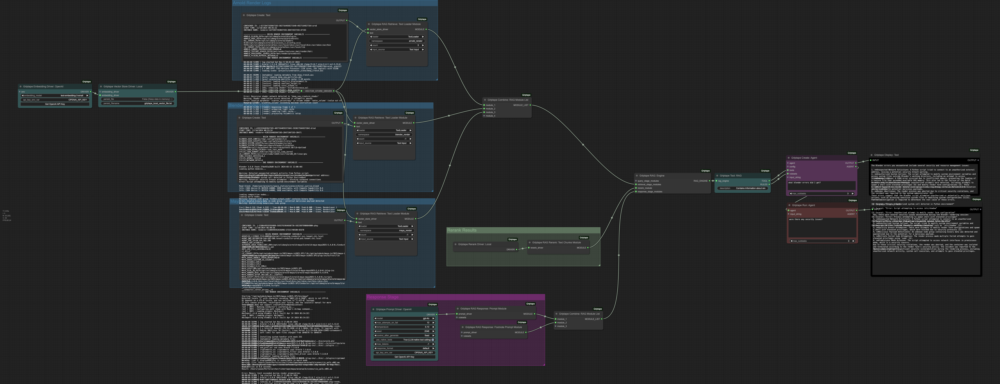

# Changelog

All notable changes to this project will be documented in this file.

The format is based on [Keep a Changelog](https://keepachangelog.com/en/1.1.0/),
and this project adheres to [Semantic Versioning](https://semver.org/spec/v2.0.0.html).

<!-- ## [Unreleased]

### Added 
### Changed
### Deprecated 
### Removed 
### Fixed 
### Security   -->

## [2.2.15] - 2025-01-05
### Fixed
- Quick fix for Merge Text node to accept type `any`

## [2.2.14] - 2025-01-05
### Added
- Added the ability to run a series of Prompt Tasks in parallel, greatly speeding up workflows where you want to pass a large list of strings to an Agent and get the response on each one.
- `Griptape Combine: String List` node takes multiple string inputs and outputs a list.
- `Griptape Run: Parallel Prompt Task` Takes an agent and a string list to run a Prompt Task on each item in the list.
- Added the [parallel_task_example.png](example_workflows/parallel_task_example.png)
  

## [2.2.13] - 2025-01-05
### Fixed
- Something changed in how ComfyUI was handling STRING inputs which caused the `Griptape Combine: Merge Text` node to break. Modified the input to handle * instead of only STRING, which fixes it.

## [2.2.12] - 2025-01-03
### Added
- Added `Griptape Display: Text as Markdown` node.
### Changed
- Reverted the `Griptape Display: Text` node back to just displaying text.

  

## [2.2.11] - 2025-28-02
### Added
- Added `min_p` and/or `top_k` to prompt drivers that support them. 
  
  - Top-k: Controls the variety of words the AI can choose from. A lower number (like 10) makes responses more focused and predictable, while a higher number (like 50) allows for more creativity and surprise.
  
  - Min-p: Sets a quality threshold for word choices. Only words with at least a certain percentage of confidence compared to the best option are considered. Lower values (like 0.05) allow more variety, while higher values (like 0.3) stick closer to the most predictable options.

  For example, if you ask the question "Give me one unexpected use for a paperclip"..
  - With low top_k/high min_p: You'll get common answers (holding papers, makeshift hook)

  - With high top_k/low min_p: You'll get more creative or unusual answers (lockpick, tiny sculpture material)

  ℹ️ Note: Some models take `top_p` instead of `min_p`. To keep the parameters persistent, I'm still using `min_p` in the node, but setting it to `1-min_p`, so it _acts_ like `top_p`.

## [2.2.10] - 2025-27-02
### Added
- Added ability to use key value pair replacement with Griptape Cloud Assistant as well.
### Fixed
- Fixed issue with agent getting the following message: `Error creating agent: 'NoneType' object has no attribute 'update'`

## [2.2.09] - 2025-27-02
### Added
- `Key Value Pair` node to allow you to create a key/value pair and output it as a dictionary.
- `Griptape Combine: Merge Dictionary` merges multiple key/value pair nodes
- `key_value_replacement` parameter on all (most) Griptape nodes which allow you to use the dicts and swap out values in a prompt. Check out the attached image to see it in action.

  

## [2.2.08] - 2025-25-02
### Added
- `GriptapeCloudPromptDriver` and `GriptapeCloudDriversConfig`. These nodes allow you to use your Griptape Cloud API key to run OpenAI `gpt-4o`. We'll be adding more models soon - but you no longer need a separate Griptape Cloud API key and OpenAI API key to run a simple agent!
- `GrokPromptDriver` and `GrokDriversConfig`. These nodes allow you to use Grok to run their latest chat and vision models. You will require a `GROK_API_KEY` available at https://console.x.ai.
### Changed
- `Griptape Display: Text` now displays Markdown properly to make output look nicer.
- `Griptape Framework` updated to `1.4.0`.

## [2.2.07] - 2025-25-02
### Added
- Added `Workflow` nodes for a `Start Workflow` and `End Workflow`. These nodes are the start of being able to drive a ComfyUI Workflow externally, giving the user specific properties they can set and specific output results when they're done. This is just getting started and there is nothing specific available to use the feature, but wanted to get it checked in.

  In this example you can see two start nodes, and the end workflow node.

  

  Some elements I need to work on:
  - Re-connecting outputs from the start-workflow node will change the name of the label. If it's been touched, I should leave it alone.
  - Would love to figure out how to rename the outputs based on the node and parameter instead of just get_property_1, get_property_2, etc.

## [2.2.06] - 2025-22-02
### Fixed
- Fixed an issue where menu separators in the Griptape Menu were missing. That's now resolved.

## [2.2.05] - 2025-17-02
### Fixed
- Fixed an issue where nodes needed to be resized to be displayed properly when being created. This was true for many of the nodes due to a bug in ComfyUI where if you had a string as an input that was set to "forceInput" (like the `input_string` on most nodes), it wouldn't display any multiline text node properly. The fix was to add `multiLine=True` on those `forceInput` nodes as well.. that solves it!

## [2.2.04] - 2025-15-02
### Fixed
- Fixed the LMStudio Embeddings url. Now LMStudio should work with the embedding driver properly.

## [2.2.03] - 2025-12-02
### Fixed
- Removed `requirements_old_33.txt` as it was no longer needed.

## [2.2.02] - 2025-12-02
### Added
- Google Prompt Driver now has `gemini-2.0-flash` and `gemini-2.0-flash-lite-preview`. https://ai.google.dev/gemini-api/docs/models/gemini#gemini-2.0-flash
- Google Embedding Driver now uses `text-embedding-004`

## [2.2.01] - 2025-11-02
### Changed
- Set OUTPUT_NODE = False on the BaseAgent to resolve: https://github.com/griptape-ai/ComfyUI-Griptape/issues/253

## [2.2.00] - 2025-11-02
### Added
- Added `LocalRerankDriver` for use with RAG reranking. No longer requires a `Cohere` API key to rerank results.
- Added support for OpenAi reasoning models: `o3-mini`, `o3`, `o1-mini`

### Changed
- Disabled automatic model loading for `Ollama` drivers. It takes a string and you can just enter the name of the model you wish to use.
- Updated all drivers to provider-specific driver namespaces. Should have no effect on the front-end, but matches requirements for Griptape 1.3.1.
- Updated the Retrieval Augmented Generation [example](example_workflows/retrieval_augmented_generation.png) to use render logs as the example, and to use the new `LocalRerankDriver` instead of `Cohere`.

    
    
## [2.1.22] - 2025-10-02
- Temporarily disabled automatic model loading for LMStudio drivers. Now it takes a string and you can just enter the name of the model you wish to use.

## [2.1.21] - 2025-07-02
### Fixed
- Found 2 more locations where `torchaudio` was in the wrong spot - fixed those as well.

## [2.1.20] - 2025-07-02
### Fixed
- Moved `torchaudio` import inside the utility function that uses it to stop it breaking Griptape Nodes for people who don't have it installed.

## [2.1.19] - 2025-31-01
### Added
- `Griptape Run: Cloud Assistant` node that will run an Assistant from [Griptape Cloud](https://cloud.griptape.ai). Requires a Griptape API Key (GT_CLOUD_API_KEY). Assistants are easy point and click agents that have access to Knowledge Bases, Tools, Threads, and Rulesets.
- `Griptape Retrieve: Cloud Ruleset` node that will use a Ruleset from [Griptape Cloud](https://cloud.griptape.ai). Make changes to your ruleset in the cloud, and it will automatically be updated with your Comfy Node.

### Changed
- Changed the API key for Griptape Cloud from `GRIPTAPE_CLOUD_API_KEY` to `GT_CLOUD_API_KEY` to match the framework defaults.

### Fixed
- `OllamaPromptDriver` and `OllamaEmbeddingDriver` nodes were not grabbing the `base_url` from settings properly. This is now fixed.

## [2.1.18] - 2025-30-01
### Fixed
- Fixed issues with environment variables not being set properly. This solves the situation where you have two agent nodes connected and the API key works once, but not a second time.

## [2.1.17] - 2025-27-01
### Deprecated
- `Griptape Code: Run Python` node will be removed in a future release due to security concerns over the `exec` command. It's recommended to use the `Griptape Code: Run Griptape Cloude Structure` instead.

## [2.1.16] - 2025-26-01
### Changed
- Modified RAG code to not use `eval` cmd due to security concerns.
### Fixed
- Fixed issue with Griptape Cloud Structure node not being created.

## [2.1.15] - 2025-26-01
### Added
- **Griptape Serper Web Driver** based on the Griptape Extension https://github.com/mertdeveci5/griptape-serper-driver-extension.
  A driver extension for [Serper.dev] (https://serper.dev/) for web searching functionality. This extension also provides functionality to search for only news, places, images and patents. You can also use a date_range parameter to restrict the search results.

  To use the driver, please get a free API key at [Serper.dev](https://serper.dev)
- Added Buttons on most Drivers to open links to the appropriate locations to get API keys. This will hopefully make it easier and more intuitive to grab an API key if you need it for a particular type of service. _Note_: API keys will still need to be added to the Griptape Settings.

### Changed
- Updated Griptape Framework to `1.2.0`
- Elevenlabs library updated from `1.50.4` to `1.50.5`
- Moved examples to [example_workflows](example_workflows/README.md) folder so the examples will show up automatically in **Workflow -> Browse Templates**.

## [2.1.14] - 2025-25-01
### Fixed
- `OllamaPromptDriver` wasn't pulling the default url from settings properly.

## [2.1.13] - 2025-18-01
### Added
- The `Create Agent` node now has a `max_subtasks` parameter that will try and help make sure the agent doesn't get caught in an infinite loop of tool use. This is especially useful when you have agents using other agents as tools, and sometimes they get "chatty". If they go back and forth too many times, the run will abort and return the reason why & what the last output was in the thread. This should give you some more control over ensuring you don't have agents running forever.
### Changed
- The [Photographer-Workflow-Comparison-Example](example_workflows/Photographer-Workflow-Comparison-Example.json) has some new rules to try and keep exchanges brief, and also takes advantage of the new `max_subtasks` parameter.

## [2.1.12] - 2025-15-01
### Changed
- Added a list of models for `Griptape Prompt Driver: Groq` based on the Supported Models page: https://console.groq.com/docs/models

## [2.1.11] - 2025-15-01
### Added 
- `Griptape Agent Config: Groq Drivers` - A Config node for using Groq (https://groq.groqcloud/). Currently contains both the PromptDriver and Audio Transcription Driver. Note: Groq doesn't currently have an embedding driver, which means in order to use it with off_prompt tools, you must use a separate embedding driver. It's on their list, but haven't heard back as to when it'll be available.
- `Griptape Prompt Driver: Groq` - a default prompt driver for working with Groq (https://groq.com/groqcloud/). You will need a `GROQ_API_KEY` to use this node, but you can get one FREE at: https://console.groq.com/keys
- `Griptape Audio Transcription Driver: Groq` - a node to use Groq to perform Audio Transcriptions. You will need a `GROQ_API_KEY` to use this node, but you can get one FREE at: https://console.groq.com/keys
### Changed
- Griptape Framework updated to `1.1.3` 
- `Griptape Embedding Driver: OpenAI Compatible` now has a string for the `embedding_model`.
### Deprecated 

## [2.1.10] - 2025-15-01
### Added 
- `GeminiQueryTool` - a patch for the QueryTool: https://github.com/griptape-ai/griptape/issues/1572
### Changed 
- `gtComfyAgent` checks to see if the `prompt_driver` is `GooglePromptDriver`. if so, it uses the `GeminiQueryTool` isntead of `QueryTool`.
- `QueryTool` now checks to see if the `prompt_driver` is `GooglePromptDriver`. If so, it uses the `GeminiQueryTool` instead of `QueryTool`.
### Fixed 
- `GooglePromptDriver` can now handle tools that are `off_prompt`.

## [2.1.09] - 2025-10-01
### Added
- Added `Ollama base_url` setting to Griptape Settings to allow you to specify a default base_url instead of always using `http://127.0.0.1`. If you change this setting, you must refresh your browser, and then re-create your existing `Ollama` nodes to get it to apply.

### Changed
- Created `settings.js` to make it easier to work with Griptape Settings for comfyUI.
- Version bump

## [2.1.08] - 2025-09-01
### Fixed
- incorrectly identified attrs and openai library versions in pyproject.

## [2.1.07] - 2025-09-01
### Fixed
- Set Default Driver wasn't working correctly due to API key not being saved (https://github.com/griptape-ai/ComfyUI-Griptape/issues/220). That's now resolved.

## [2.1.06] - 2025-04-01
### Fixed
- incorrectly identified attrs and openai library versions in pyproject.

## [2.1.05] - 2025-04-01
### Fixed
- `openai_utils` no longer breaks startup if OPENAI_API_KEY is incorrect.

## [2.1.04] - 2025-04-01
### Added 
- `Griptape Util: Switch Node` - This node lets you choose an output from multiple inputs.

  

## [2.1.03] - 2025-03-01
### Fixed
- Added check for existing user directory - if it doesn't exist, creates it instead of exiting.

## [2.1.02] - 2025-03-01
### Fixed
- Pinned `openai` to `>=1.58.1`

## [2.1.01] - 2025-03-01
### Fixed
- Updated `attrs` library to `>=24.3.0`

## [2.1.00] - 2025-03-01
### Changed
- Updated Griptape Framework to 1.1.0
- Updated Poetry to version 1.8.5
- Set default `max_attempts_on_fail` for prompt drivers to 2 instead of 10.
### Removed
- `Griptape Code: Run Python` node was echoing code to console.log. This has been removed.

## [2.0.17] - 2025-02-01
### Fixed
- Updated text when running Python code is not enabled.
### Removed
- in `gtUICodeExecutionTask.py` removed unused `unique_id` variable.

## [2.0.16] - 2025-02-01
### Added
- [Example](example_workflows/README.md#sorting-a-csv---by-using-generic-python) for using the `Griptape Code: Run Python` node.
  
### Fixed
- Templates not listed for `Griptape Code: Run Python` node.

## [2.0.15] - 2025-02-01
### Added 
- `Griptape Code: Run Griptape Cloud Structure` - Runs a structure from [Griptape Cloud Structures](https://cloud.griptape.ai/structures). Requires a `GT_CLOUD_API_KEY` and a `structure_id`. 
- `Griptape Code: Run Python` - Creates a node that lets you execute Python code. The output of the node is any data supplied to the `output` variable.
- `Code Execution Templates` - A list of templated code examples the user can pick from.
- `Griptape Settings`
  - `Enable Griptape Code: Run Python Nodes` - user option to enable the `Griptape Code: Run Python` node
  - `Enable Insecure Griptape Code: Run Python [DANGER]` - additional user option to skip any checking for dangerous code. Recommended to keep this OFF - and only enable it if you know what you're doing.
### Fixed 
- `@Griptape` was missing from settings due to a ComfyUI change. Renamed to `Griptape`.

## [2.0.14] - 2025-01-01
### Fixed
- Griptape settings restored. It was not showing up with the name `@Griptape` so I renamed the category to `!Griptape`.

## [2.0.13] - 2024-31-12
### Fixed
- Quick fix for CHANGELOG link in release notes.

## [2.0.12] - 2024-31-12
### Added
- Updated CHANGELOG.md
- Standard testing for spelling errors, Typing, and more.

### Removed
- Manual version tracking in `versions.js` and instead am pulling information from `pyproject.toml`
- `griptape_config.py`

## Historical Changelog

Entries below were recorded before moving to this new `CHANGELOG.md` method.

### Dec 31, 2024
 * Removed manual version tracking in versions.js and now pulling the information from the `pyproject.toml`. To see what version you're running, choose RMB -> Griptape and look at the `Version` information.
 * Removed `griptape_config.py` as it's no longer being used
 * Added testing to catch spelling, type, and other errors. _Note_: This was a massive effort - hopefully it didn't introduce any errors.

### Dec 27, 2024
 * Fixed missing classmethod for OllamaPromptDriver
 
### Dec 24, 2024
 * Fixed missing api key for OpenAI when getting a list of available models.
 * Removed Ollama's model check using the library in favor of a javascript option.
 
### Dec 21, 2024
 * Fixed issue where Griptape Agent Config: Custom Structure node was still requiring OPENAI_API_KEY.
 * Updated to Griptape v1.0.2
 * OpenAi, Anthropic, and Ollama nodes pull directly from their apis now to get the available models.
 * Added check to ensure Ollama not running doesn't cause Griptape Nodes to fail.
 
### Dec 12, 2024
 * Updated to Griptape Framework 1.0! 
 * Added check for BlackForest install issues to not block Griptape Nodes running

### Nov 30, 2024
* New Nodes:
  * `Griptape Driver: Black Forest Labs Image Generation` - Now generate images with the incredible Flux models - `flux-pro-1.1`, `flux-pro`, `flux-dev`, and `flux-pro-1.1-ultra`. 
    - Requires an API_KEY from Black Forest Labs (https://docs.bfl.ml/)
    - Utilizes new Griptape Extension: https://github.com/griptape-ai/griptape-black-forest
  
  
   
    - It also works with the `Griptape Create: Image Variation` node.

    

  * `Griptape Create: Image Inpainting Variation` to the Griptape -> Image menu. Gives the ability to paint a mask and replace that part of the image.
  
  

### Nov 29, 2024
* Iterating on configuration settings to improve compatibility with ComfyUI Desktop

### Nov 28, 2024
* ⚠️ **Temporarily removed BlackForestLabs Driver nodes while resolving install issues**. There appears to be an installation issue for these nodes, so I'm _temporarily_ removing them until it's resolved.
* Removed old configuration settings - now relying completely on ComfyUI's official settings

### Nov 27, 2024

* Added example: [PDF -> Profile Pic](example_workflows/pdf_to_profile_pic.png) where a resume in pdf form is summarized, then used as inspiration for an image generation prompt to create a profile picture.

* Fixed: `gtUIKnowledgeBaseTool` was breaking if a Griptape Cloud Knowledge Base had an `_` in the name. It now handles that situation.

### Nov 26, 2024
* Upgrade to Griptape Framework v0.34.3
* New Nodes:
  * `Griptape Create: Image Inpainting Variation` to the Griptape -> Image menu. Gives the ability to paint a mask and replace that part of the image.
  
  

  * `Griptape Run: Task` - Combines/Replaces `Griptape Run: Prompt Task`, `Griptape Run: Tool Task`, and `Griptape Run Toolkit Task` into a single node that knows what to do.
  * `Griptape Run: Text Extraction` to the Griptape -> Text menu
* Added `keep_alive` parameter to `Ollama Prompt Driver` to give the user the ability to control how long to keep the model running. Setting it to 0 will do the same as an `ollama stop <model>` command-line execution. Default setting is 240 seconds to match the current default.

* Moved node: `Griptape Run: Text Summary` to the Griptape -> Text menu
* Updated `Griptape RAG Retrieve: Text Loader Module` to take a file input or text input.
* Fixed ExtractionTool to use a default of `gpt-4o-mini`
* Added some text files for testing text loading
* Added Examples to [Examples Readme](example_workflows/README.md)
  * [Render Log Review](example_workflows/render_log_review.png)
  * [Flux Pro 1.1 Image Generation](example_workflows/griptape_black_forest_labs_create_image.png)
  * [Flux Pro 1.0-Canny Image Variation](example_workflows/griptape_black_forest_labs_create_variation.png)
  * [Flux Pro 1.0-Fill Image InPainting](example_workflows/griptape_black_forest_flux_inpainting.png)

### Nov 9, 2024
* Upgrade to Griptape Framework v0.34.2
* Fixed combine nodes breaking when re-connecting output

### Nov 6, 2024
* Upgrade to Griptape Framework v0.34.1
  * Fix to `WebScraperTool` provides better results when using `off_prompt`.
* Fixed bug where urls were dropping any text after the `:`. Example: "What is https://griptape.ai" was being converted to "What is https:". This is due to the `dynamicprompt` functionality of ComfyUI, so I've disabled that.
* Added context string to all BOOLEAN parameters to give the user a better idea as to what the particular boolean option does. For example, instead of just `True` or `False`, the tools now explain `off_prompt`.

  

### Nov 4, 2024
* Fixed bug where OPENAI_API_KEY was still required, and was causing some install issues.
* Added video to README with how to manage api keys.

### Nov 1, 2024
* Major reworking of how API keys are set. Now you can use the ComfyUI Settings window and add your API keys there. This should simplify things quite a bit as you no longer need to create a `.env` file in your ComfyUI folder.

  * Note: Existing environment variables will be picked up automatically.

  

### Oct 31, 2024
* Added tooltips for all drivers to help clarify properties
* Added fix for Ollama Driver Config so it wouldn't fail if no embedding driver was specified.
* Fix for Convert Agent to Tool node.

### Oct 30, 2024
* Updated to Griptape Framework v0.34.0
* **Breaking Changes**
  * `AnthropicDriversConfig` node no longer includes Embedding Driver. If you wish to use Claude within a RAG pipeline, build a `Config: Custom Structure` using a Prompt Driver, Embedding Driver, and Vector Store Driver. See the attached image for an example:
  
      

### Oct 23, 2024
* Updated Anthropic Claude Prompt Driver to include `claude-3-5-sonnet-20241022`
* Updated Anthropic Claude Config to offer option to not use Voyage API for Embedding Driver. Just set `ignore_voyage_embedding_driver` to `True`

### Oct 11, 2024
* Updated to Griptape Framework v0.33.1 to resolve install bugs

### Oct 10, 2024
* Updated to Griptape Framework v0.33
* Added `TavilyWebSearchDriver`. Requires a Tavily [api key](https://app.tavily.com/).
* Added `ExaWebSearchDriver`. Requires an Exa [api key](https://dashboard.exa.ai/api-keys). 

### Sept 20, 2024
* Hotfix for `Griptape Agent Config: LM Studio Drivers`. The `base_url` parameter wasn't being set properly causing a connection error. 

### Sept 12, 2024
* Hotfix for `Griptape Run: Tool Task` node. It now properly handles the output of the tool being a list.

### Sept 11, 2024
* Added `top_p` and `top_k` to Anthropic and Google Prompt Drivers
* Fixed automatic display node text resizing
* Fixed missing display of the Env node

### Sept 10, 2024
* **New Nodes** Griptape now has the ability to generate new models for `Ollama` by creating a Modelfile. This is an interesting technique that allows you to create new models on the fly.
  * `Griptape Util: Create Agent Modelfile`. Given an agent with rules and some conversation as an example, create a new Ollama Modelfile with a SYSTEM prompt (Rules), and MESSAGES (Conversation).
  * `Griptape Util: Create Model from Modelfile`. Given a Modelfile, create a new Ollama model.
  * `Griptape Util: Remove Ollama Model`. Given an Ollama model name, remove the model from Ollama. This will help you cleanup unnecessary models. _Be Careful with this one, as there is no confirmation step!_

  

### Sept 5, 2024
**MAJOR UPDATE**
* Update to Griptape Framework to v0.31.0

* There are some New Configuration Drivers nodes! These new nodes replace the previous `Griptape Agent Config` nodes (which still exist, but have been deprecated). They display the various drivers that are available for each general config, and allow you to make changes per driver. See the image for examples:

* Old `Griptape Agent Config` nodes still exist, but have been deprecated. They will be removed in a future release. Old workflows should automatically display the older nodes as deprecated. It's **highly recommended** to replace these old nodes with the new ones. I have tried to minimize breaking nodes, but if some may exist. I apologize for this if it happens.

* New Nodes
  * `Griptape Agent Config: Cohere Drivers`: A New Cohere node.
  * `Griptape Agent Config: Expand`: A node that lets you expand Config Drivers nodes to get to their individual drivers.
  * `Griptape RAG Nodes` a whole new host of nodes related to Retrieval Augmented Generation (RAG). I've included a sample in the [examples](example_workflows/retrieval_augmented_generation.json) folder that shows how to use these nodes. 
  
  The new nodes include:
    * `Griptape RAG: Tool` - A node that lets you create a tool for RAG.
    * `Griptape RAG: Engine` - A node that lets you create an engine for RAG containing multiple stages. Learn more here: https://docs.griptape.ai/stable/griptape-framework/engines/rag-engines/:
      * Query stage - a stage that allows you to manipulate a user's query before RAG starts.
      * Retrieval stage - the stage where you gather the documenents and vectorize them. This stage can contain multiple "modules" which can be used to gather documents from different sources.
      * Rerank stage - a stage that re-ranks the results from the retrieval stage.
      * Response stage - a stage that uses a prompt model to generate a response to the user's question. It also includes multiple modules.
    * `Griptape Combine: RAG Module List` - A node that lets you combine modules for a stage.
    * Various Modules:
      * `Griptape RAG Query: Translate Module` - A module that translates the user's query into another language.
      * `Griptape RAG Retrieve: Text Loader Module` - A module that lets you load text and vectorize it in real time.
      * `Griptape RAG Retrieve: Vector Store Module` - A module that lets you load text from an existing Vector Store.
      * `Griptape RAG Rerank: Text Chunks Module` - A module that re-ranks the text chunks from the retrieval stage.
      * `Griptape RAG Response: Prompt Module` - Uses an LLM Prompt Driver to generate a response.
      * `Griptape RAG Response: Text Chunks Module` - Just responds with Text Chunks.
      * `Griptape RAG Response: Footnote Prompt Module` - A Module that ensures proper footnotes are included in the response.

### Aug 30, 2024
* Added `max_tokens` to most configuration and prompt_driver nodes. This gives you the ability to control how many tokens come back from the LLM. _Note: It's a known issue that AmazonBedrock doesn't work with max_tokens at the moment._
* Added `Griptape Tool: Extraction` node that lets you extract either json or csv text with either a json schema or column header definitions. This works well with TaskMemory.
* Added `Griptape Tool: Prompt Summary` node that will summarize text. This works well with TaskMemory.

### Aug 29, 2024
* Updated griptape version to 0.30.2 - This is a major change to how Griptape handles configurations, but I tried to ensure all nodes and workflows still work. Please let us know if there are any issues.
* Added `Griptape Tool: Query` node to allow Task Memory to go "Off Prompt"

### Aug 27, 2024
* Fixed bugs where inputs of type "*" weren't working
* Updated frontend display of type `string` for `Griptape Display: Data as Text` node.

### Aug 21, 2024
* Fixed querying for models in LMStudio and Ollama on import

### Aug 20, 2024
* Update Griptape Framework to v029.2
* Modified ImageQueryTask to switch to a workflow if more than 2 images are specified
* Updated tests

### Aug 4, 2024
* Updating Griptape Framework to v029.1
* Added `Griptape Config: Environment Variables` node to allow you to add environment variables to the graph
* Added `Griptape Text: Load` node to load a text file from disk
* Added Ollama Embedding Model
* Added GriptapeCloudKnowledgeBaseVectorStoreDriver that allows you to query a knowledge base in Griptape Cloud. Requires a Griptape Cloud account (https://cloud.griptape.ai), a Data Source, and a Knowledge Base. Also requires an API key: `GT_CLOUD_API_KEY` that you can get from your [Griptape Cloud API Page](https://cloud.griptape.ai/account/api-keys).

### Aug 3, 2024
* Reverted ollama and lmstudio configuration nodes to a list of installed models using new method for grabbing them. 

### July 29, 2024
* Temporarily replaceing the ollama config nodes with a string input for specifying the model instead of a list of installed models.

### July 27, 2024
* Updated menu items to be in a better order. Please provide feedback!

### July 25, 2024
* Added separators to menu items in the RMB->Griptape menu to help group similar items.

### July 24, 2024
* Added default colors to help differentiate between types of nodes. Tried to keep it minimal and distinct.
  * Agent support nodes (Rules, Tools, Drivers, Configurations): `Blue`
    Rationale: Blue represents stability and foundational elements. Using it for all agent-supporting nodes shows their interconnected nature.
  
  * Agents: `Purple`
    Rationale: Purple often represents special or unique elements. This makes Agents stand out as the central, distinct entities in the system.

  * Tasks: `Red`
    Rationale: Red signifies important actions, fitting for task execution nodes.

  * Output nodes: `Black`
    Rationale: Black provides strong contrast, suitable for final output display.

  * Utility nodes (Merge, Conversion, Text creation, Loaders): No color (`gray`)
    Rationale: Keeping utility functions in a neutral color helps reduce visual clutter and emphasizes their supporting role.

* **New Node** SaveText. This is a simple SaveText node as requested by a user. Please check it out and give feedback.
    
### July 23, 2024
* Fixed bug with VectorStoreDrivers that would cause ComfyUI to fail loading if no OPENAI_API_KEY was present.

### July 22, 2024
* **New Nodes** A massive amount of new nodes, allowing for ultimate configuration of an Agent.
  * **Griptape Agent Configuration**
    * **Griptape Agent: Generic Structure** - A Generic configuration node that lets you pick any combination of `prompt_driver`, `image_generation_driver`, `embedding_driver`, `vector_store_driver`, `text_to_speech_driver`, and `audio_transcription_driver`.
    * **Griptape Replace: Rulesets on Agent** - Gives you the ability to replace or remove rulesets from an Agent.
    * **Griptape Replace: Tools on Agent** - Gives you the ability to replace or remove tools from an Agent

  * **Drivers**
    * **Prompt Drivers** - Unique chat prompt drivers for `AmazonBedrock`, `Cohere`, `HuggingFace`, `Google`, `Ollama`, `LMStudio`, `Azure OpenAi`, `OpenAi`, `OpenAiCompatible`
    * **Image Generation Drivers** - These all existed before, but adding here for visibility: `Amazon Bedrock Stable Diffusion`, `Amazon Bedrock Titan`, `Leonardo AI`, `Azure OpenAi`, `OpenAi`
    * **Embedding Drivers** - Agents can use these for generating embeddings, allowing them to extract relevant chunks of data from text. `Azure OpenAi`, `Voyage Ai`, `Cohere`, `Google`, `OpenAi`, `OpenAi compatible`
    * **Vector Store Drivers** - Allows agents to access Vector Stores to query data: ``Azure MongoDB`, `PGVector`, `Pinecone`, `Amazon OpenSearch`, `Qdrant`, `MongoDB Atlas`, `Redis`, `Local Vector Store`
    * **Text To Speech Drivers** - Gives agents the ability to convert text to speech. `OpenAi`, `ElevenLabs`
    * **Audio Transcription Driver** - Gives agents the ability to transcribe audio. `OpenAi`
    * re-fixed spelling of `Compatible`, because it's a common mistake. :)

  * **Vector Store** - New Vector Store nodes - `Vector Store Add Text`, `Vector Store Query`, and `Griptape Tool: VectorStore` to allow you to work with various Vector Stores

  * **Environment Variables parameters** - all nodes that require environmetn variables & api keys have those environment variables specified on the nodes. This should make it easier to know what environment variables you want to set in `.env`.

  * **Examples** - Example workflows are now available in the `/examples` folder [here](example_workflows/README.md).

* **Breaking Change**
  * There is no longer a need for an `ImageQueryDriver`, so the `image_query_model` input has been removed from the configuration nodes. 
  * Due to how comfyUI handles input removal, the values of non-deleted inputs on some nodes may be broken. Please double-check your values on these Configuration nodes.
  
### July 17, 2024
* Simplified API Keys by removing requirements for `griptape_config.json`. Now all keys are set in `.env`.
* Fixed bug where Griptape wouldn't launch if no `OPENAI_API_KEY` was set.

### July 16, 2024
* Reorganized all the nodes so each class is in it's own file. should make things easier to maintain
* Added `max_attemnpts_on_fail` parameter to all Config nodes to allow the user to determine the number of retries they want when an agent fails. This maps to the `max_attempts` parameter in the Griptape Framework.
* **NewNode**: Audio Driver: Eleven Labs. Uses the ElevenLabs api. Takes a model, a voice, and the ELEVEN_LABS_API_KEY. https://elevenlabs.io/docs/voices/premade-voices#current-premade-voices
* **NewNode**: Griptape Run: Text to Speech task
* **NewNode**: Added AzureOpenAI Config node. To use this, you'll need to set up your Azure endpoint and get API keys. The two environment variables required are `AZURE_OPENAI_ENDPOINT` and `AZURE_OPENAI_API_KEY`. You will also require a [deployment name](https://learn.microsoft.com/en-us/azure/ai-services/openai/how-to/switching-endpoints). This is available in [Azure OpenAI Studio](https://oai.azure.com/)
* Updated README

### July 12, 2024
* Updated to Griptape v0.28.2
* **New Node** Griptape Config: OpenAI Compatible node. Allows you to connect to services like https://www.ohmygpt.com/ which are compatible with OpenAi's api.
* **New Node** HuggingFace Prompt Driver Config
* Reorganized a few files
* Removed unused DuckDuckGoTool now that Griptape supports drivers.

### July 11, 2024
* The Display Text node no longer clears it's input if you disconnect it - which means you can use it as a way to generate a prompt, and then tweak it later.
* Added Convert Agent to Tool node, allowing you to create agents that have specific skills, and then give them to another agent to use when it feels it's appropriate.

### July 10, 2024

* Updated to work with Griptape v0.28.1
* Image Description node now can handle multiple images at once, and works with Open Source llava.
* Fixed tool, config, ruleset, memory bugs for creating agents based on update to v0.28.0
* **New Nodes** Added WebSearch Drivers: DuckDuckGo and Google Search. To use Google Search, you must have two API keys - GOOGLE_API_KEY and GOOGLE_API_SEARCH_ID. 

### July 9, 2024

* Updated LMStudio and Ollama config nodes to use 127.0.0.1
* Updated `Create Agent` and `Run Agent` nodes to no longer cache their knowledge between runs. Now if the `agent` input isn't connected to anything, it will create a new agent on each run.

### July 2, 2024

* All input nodes updated with dynamic inputs. Demonstration here: https://youtu.be/1fHAzKVPG4M?si=6JHe1NA2_a_nl9rG
* Fixed bug with Text to Combo node
