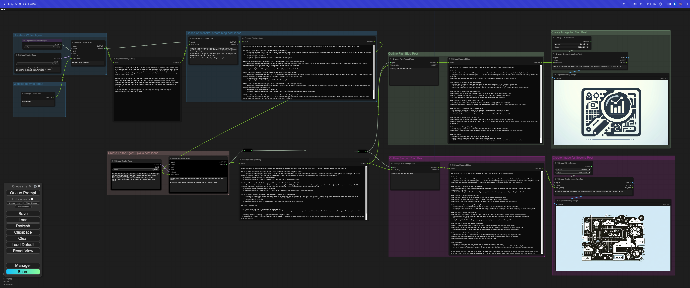

# ComfyUI Griptape Nodes

This repo creates a series of nodes that enable you to utilize the [Griptape Python Framework](https://github.com/griptape-ai/griptape/) with [ComfyUI](https://github.com/comfyanonymous/ComfyUI), integrating AI into your workflow.

This example creates two [Griptape Agents](https://docs.griptape.ai/stable/griptape-framework/structures/agents/) - a Writer and an Editor. The writer has a [WebScraper](https://docs.griptape.ai/stable/griptape-tools/official-tools/web-scraper/) tool and gets a description of a website. It then generates blog topic ideas and passes them to_ the Editor Agent. The editor chooses the top 3 topics, and generates outlines and next actions for the next two. A third Agent generates thumbnail images for each blog post using a [Prompt Image Generation Task](https://docs.griptape.ai/stable/griptape-framework/structures/tasks/#prompt-image-generation-task) based on the outlines.



The repo currently has a subset of Griptape nodes, with more to come soon. Current nodes can:

* Create [Agents](https://docs.griptape.ai/stable/griptape-framework/structures/agents/) using these models:
    * OpenAI
    * Amazon Bedrock 
    * Google Gemini
    * Anthropic Claude

* Control agent behavior with access to [Rules and Rulesets][https://docs.griptape.ai/stable/griptape-framework/structures/rulesets/]
* Give Agents access to [Tools](https://docs.griptape.ai/stable/griptape-tools/):
    * [Calculator](https://docs.griptape.ai/stable/griptape-tools/official-tools/calculator/)
    * [DateTime](https://docs.griptape.ai/stable/griptape-tools/official-tools/date-time/)
    * [WebScraper](https://docs.griptape.ai/stable/griptape-tools/official-tools/web-scraper)
    * [FileManager](https://docs.griptape.ai/stable/griptape-tools/official-tools/file-manager)
    * [GriptapeCloudKnowledgeBaseClient](https://docs.griptape.ai/stable/reference/griptape/tools/#griptape.tools.GriptapeCloudKnowledgeBaseClient)

* Run specific Agent Tasks:
    * [PromptTask](https://docs.griptape.ai/stable/griptape-framework/structures/tasks/#prompt-task)
    * [TextSummaryTask](https://docs.griptape.ai/stable/griptape-framework/structures/tasks/#text-summary-task)
    * [ToolTask](https://docs.griptape.ai/stable/griptape-framework/structures/tasks/#tool-task)
    * [ToolkitTask](https://docs.griptape.ai/stable/griptape-framework/structures/tasks/#toolkit-task)
    * [PromptImageGenerationTask](https://docs.griptape.ai/stable/griptape-framework/structures/tasks/#prompt-image-generation-task)
    * [ImageQueryTask](https://docs.griptape.ai/stable/griptape-framework/structures/tasks/#image-query-task)
    * [VariationImageGenerationTask](https://docs.griptape.ai/stable/griptape-framework/structures/tasks/#variation-image-generation-task) (In Beta)

* [Generate Images](https://docs.griptape.ai/stable/griptape-framework/structures/tasks/#image-generation-tasks) using these models:
    * OpenAI
    * Amazon Bedrock Stable Diffusion
    * Amazon Bedrock Titan
    * Leonardo.AI

 
## Example

In this example, we're using three `Image Description` nodes to describe the given images. Those descriptions are then `Merged` into a single string which is used as inspiration for creating a new image using the `Create Image from Text` node, driven by an `OpenAI Driver`.


## Installation

#### 1. ComfyUI

Install [ComfyUI](https://github.com/comfyanonymous/ComfyUI) using the [instructions](https://github.com/comfyanonymous/ComfyUI?tab=readme-ov-file#installing) for your particular operating system.

#### 2. Install Griptape-ComfyUI

There are two methods for installing the Griptape-ComfyUI repository. You can either download or git clone this repository inside the `ComfyUI/custom_nodes`, or use the [ComfyUI Manager](https://github.com/ltdrdata/ComfyUI-Manager).

* Option A - **ComfyUI Manager** _(Recommended)_

    1. Install ComfyUI Manager by following the [installation instructions](https://github.com/ltdrdata/ComfyUI-Manager#installation).
    2. Click **Manager** in ComfyUI to bring up the ComfyUI Manager
    3. Click **Install via Git URL**
    4. Enter the URL for ComfyUI-Griptape: https://github.com/griptape-ai/ComfyUI-Griptape
    5. Click **OK**
    6. Follow the rest of the instructions.

* Option B - **Git Clone**

    1. Open a terminal and input the following commands:

        ```
        cd /path/to/comfyUI
        cd custom_nodes
        git clone https://github.com/griptape-ai/ComfyUI-Griptape
        ```

#### 3. Make sure libraries are loaded

There are required libraries for the ComfyUI-Griptape nodes. They're called out in the requirements.txt file:

```bash
griptape[all]
python-dotenv
```

These should get installed automatically if you used the ComfyUI Manager installation method. However, if you're running into issues, please install them yourself either using `pip` or `poetry`, depending on your installation method.

* Option A - **pip**

    ```bash
    pip install "griptape[all]" python-dotenv
    ```

* Option B - **poetry**

    ```bash
    poetry add "griptape[all]" python-dotenv
    ```

#### 4. Add API keys to your Environment

Certain API keys are required for various nodes to work. It's recommended to add these to a `.env` file in your base comfyUI folder before you start ComfyUI. 

_Note: Most nodes will work fine with just the `OPENAI_API_KEY`, so at least make sure you have that one._

```bash
OPENAI_API_KEY=
GOOGLE_API_KEY=
AWS_ACCESS_KEY_ID=
AWS_SECRET_ACCESS_KEY=
LEONARDO_API_KEY=
ANTHROPIC_API_KEY=
VOYAGE_API_KEY=
```

You can get the appropriate API keys from these respective sites:

* OPENAI_API_KEY: https://platform.openai.com/api-keys
* GOOGLE_API_KEY: https://makersuite.google.com/app/apikey
* AWS_ACCESS_KEY_ID & SECURITY_ACCESS_KEY:
    * Open the [AWS Console](https://console.aws.amazon.com/)
    * Click on your username near the top right and select **Security Credentials**
    * Click on **Users** in the sidebar
    * Click on your username
    * Click on the **Security Credentials** tab
    * Click **Create Access Key**
    * Click **Show User Security Credentials**
* LEONARDO_API_KEY: https://docs.leonardo.ai/docs/create-your-api-key
* ANTHROPIC_API_KEY: https://console.anthropic.com/settings/keys
* VOYAGE_API_KEY: https://dash.voyageai.com/

---

## Troubleshooting

#### API Keys

When you run ComfyUI with the Griptape nodes installed, the installation method will check your environment variables and automatically install the appropriate API keys in a file called: `griptape.config.json`.

If for some reason your environment variables aren't being set properly, you can do this manually by simply copying over the `griptape.config.json.default` file to `griptape.config.json` and add the proper keys there.

If you ever need to change your API keys, go ahead and update that configuration file with the proper key.
