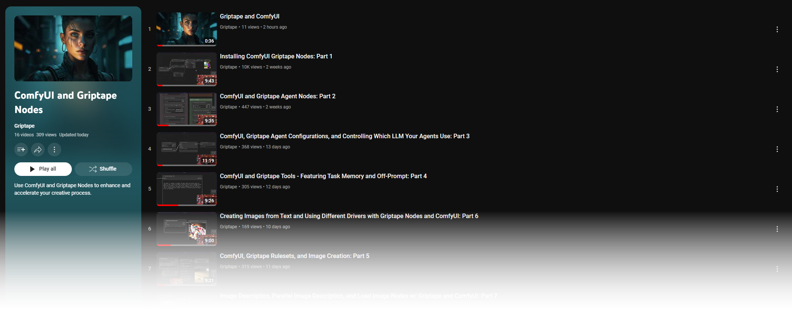
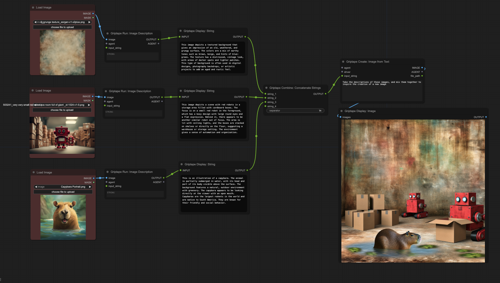
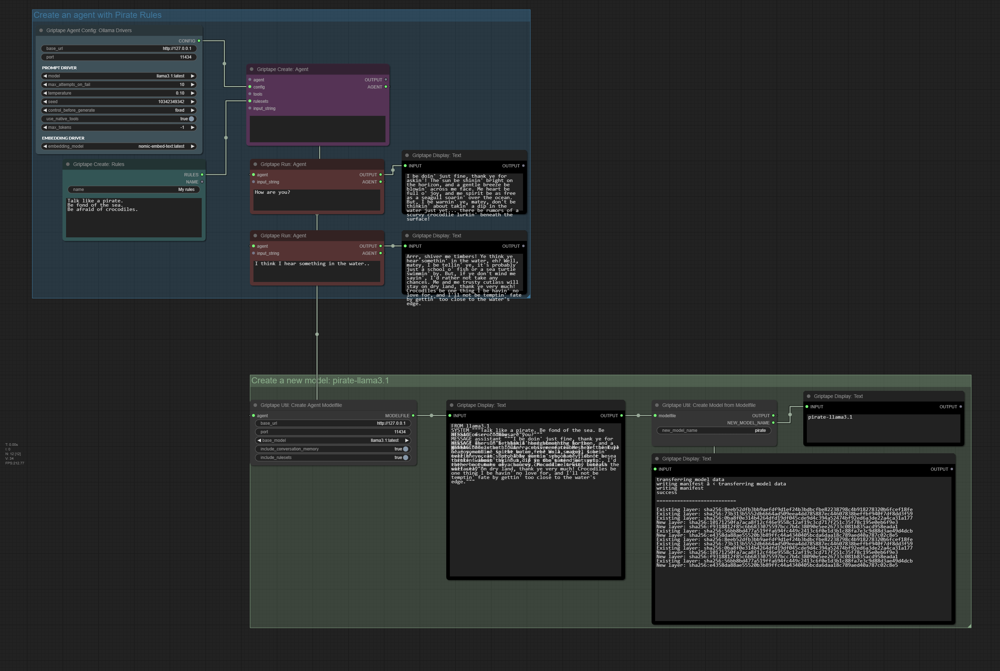
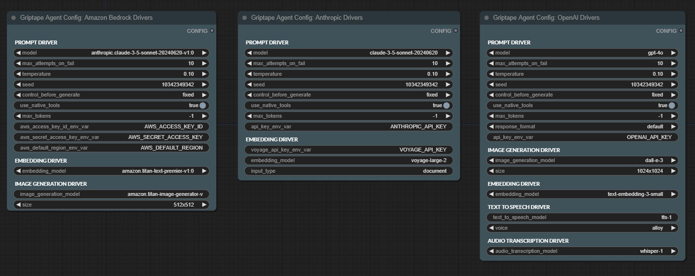
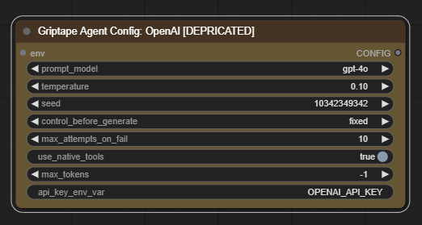
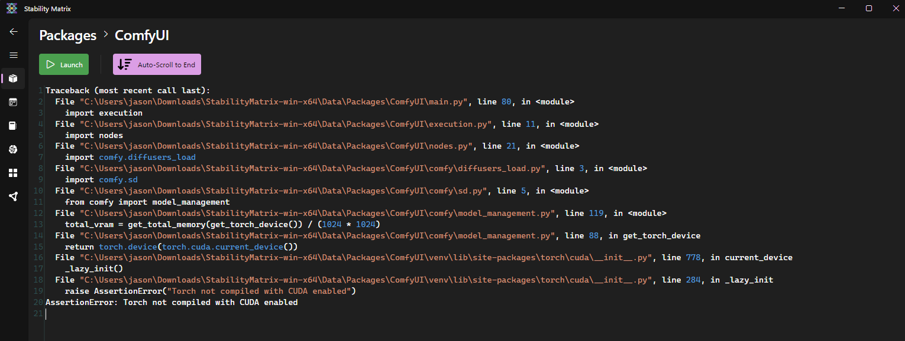

# ComfyUI Griptape Nodes

This repo creates a series of nodes that enable you to utilize the [Griptape Python Framework](https://github.com/griptape-ai/griptape/) with [ComfyUI](https://github.com/comfyanonymous/ComfyUI), integrating LLMs (Large Language Models) and AI into your workflow.

### Instructions and tutorials

Watch the trailer and all the instructional videos on our [YouTube Playlist](https://www.youtube.com/playlist?list=PLZRzNKLLiEyeK9VN-i53sUU1v5vBLl-nG).

[](https://www.youtube.com/playlist?list=PLZRzNKLLiEyeK9VN-i53sUU1v5vBLl-nG)

The repo currently has a subset of Griptape nodes, with more to come soon. Current nodes can:

* Create [Agents](https://docs.griptape.ai/stable/griptape-framework/structures/agents/) that can chat using these models:
    * Local - via **Ollama** and **LM Studio**
        * Llama 3
        * Mistral
        * etc..
    * Via Paid API Keys
        * OpenAI
        * Azure OpenAI
        * Amazon Bedrock 
        * Cohere
        * Google Gemini
        * Anthropic Claude
        * Hugging Face (_Note: Not all models featured on the Hugging Face Hub are supported by this driver. Models that are not supported by Hugging Face serverless inference will not work with this driver. Due to the limitations of Hugging Face serverless inference, only models that are than 10GB are supported._)

* Control agent behavior and personality with access to [Rules and Rulesets](https://docs.griptape.ai/stable/griptape-framework/structures/rulesets/).
* Give Agents access to [Tools](https://docs.griptape.ai/stable/griptape-tools/):
    * [Calculator](https://docs.griptape.ai/stable/griptape-tools/official-tools/calculator/)
    * [DateTime](https://docs.griptape.ai/stable/griptape-tools/official-tools/date-time/)
    * [WebScraper](https://docs.griptape.ai/stable/griptape-tools/official-tools/web-scraper)
    * [FileManager](https://docs.griptape.ai/stable/griptape-tools/official-tools/file-manager)
    * [AudioTranscriptionClient](https://docs.griptape.ai/stable/griptape-tools/official-tools/audio-transcription-client/)
    * [GriptapeCloudKnowledgeBaseClient](https://docs.griptape.ai/stable/reference/griptape/tools/#griptape.tools.GriptapeCloudKnowledgeBaseClient)
    * [GriptapeVectorStoreClient](https://docs.griptape.ai/stable/griptape-tools/official-tools/vector-store-client/)

* Run specific Agent Tasks:
    * [PromptTask](https://docs.griptape.ai/stable/griptape-framework/structures/tasks/#prompt-task)
    * [TextSummaryTask](https://docs.griptape.ai/stable/griptape-framework/structures/tasks/#text-summary-task)
    * [ToolTask](https://docs.griptape.ai/stable/griptape-framework/structures/tasks/#tool-task)
    * [ToolkitTask](https://docs.griptape.ai/stable/griptape-framework/structures/tasks/#toolkit-task)
    * [PromptImageGenerationTask](https://docs.griptape.ai/stable/griptape-framework/structures/tasks/#prompt-image-generation-task)
    * [ImageQueryTask](https://docs.griptape.ai/stable/griptape-framework/structures/tasks/#image-query-task)
    * [VariationImageGenerationTask](https://docs.griptape.ai/stable/griptape-framework/structures/tasks/#variation-image-generation-task) (In Beta)
    * [AudioTranscriptionTask](https://docs.griptape.ai/stable/griptape-framework/structures/tasks/#audio-transcription-task)
    * [TextToSpeechTask](https://docs.griptape.ai/stable/griptape-framework/structures/tasks/#text-to-speech-task)

* [Generate Images](https://docs.griptape.ai/stable/griptape-framework/structures/tasks/#image-generation-tasks) using these models:
    * OpenAI
    * Amazon Bedrock Stable Diffusion
    * Amazon Bedrock Titan
    * Leonardo.AI

* Audio
    * Transcribe Audio
    * Text to Voice

## Ultimate Configuration

Use nodes to control every aspect of the Agents behavior, with the following drivers:
* Prompt Driver
* Image Generation Driver
* Embedding Driver
* Vector Store Driver
* Text to Speech Driver
* Audio Transcription Driver


## Example

In this example, we're using three `Image Description` nodes to describe the given images. Those descriptions are then `Merged` into a single string which is used as inspiration for creating a new image using the `Create Image from Text` node, driven by an `OpenAI Driver`.

The following image is a workflow you can drag into your ComfyUI Workspace, demonstrating all the options for configuring an Agent.



## More examples

You can previous and download more examples [here](examples/README.md).

## Using the nodes - Video Tutorials
1. Installation: https://youtu.be/L4-HnKH4BSI?si=Q7IqP-KnWug7JJ5s
2. Griptape Agents: https://youtu.be/wpQCciNel_A?si=WF_EogiZRGy0cQIm 
3. Controlling which LLM your Agents use: https://youtu.be/JlPuyH5Ot5I?si=KMPjwN3wn4L4rUyg
4. Griptape Tools - Featuring Task Memory and Off-Prompt: https://youtu.be/TvEbv0vTZ5Q
5. Griptape Rulesets, and Image Creation:  https://youtu.be/DK16ouQ_vSs
6. Image Generation with multiple drivers: https://youtu.be/Y4vxJmAZcho
7. Image Description, Parallel Image Description: https://youtu.be/OgYKIluSWWs?si=JUNxhvGohYM0YQaK
8. Audio Transcription: https://youtu.be/P4GVmm122B0?si=24b9c4v1LWk_n80T
9. Using Ollama as a Configuration Driver: https://youtu.be/jIq_TL5xmX0?si=ilfomN6Ka1G4hIEp
10. Combining Rulesets: https://youtu.be/3LDdiLwexp8?si=Oeb6ApEUTqIz6J6O
11. Integrating Text: https://youtu.be/_TVr2zZORnA?si=c6tN4pCEE3Qp0sBI
12. New Nodes & Quality of life improvements: https://youtu.be/M2YBxCfyPVo?si=pj3AFAhl2Tjpd_hw
13. Merge Input Data: https://youtu.be/wQ9lKaGWmZo?si=FgboU5iUg82pXRkC
14. Setting default agent configurations: https://youtu.be/IkioCcldEms?si=4uUu-y9UvIJWVBdE
15. Merge Text with dynamic inputs and custom separator: https://youtu.be/1fHAzKVPG4M?si=6JHe1NA2_a_nl9rG 
16. Multiple Image Descriptions and Local Multi-Modal Models: https://youtu.be/KHz7CMyOk68?si=oQXud6NOtNHrXLez
17. WebSearch Node Now Allows for Driver Functionality in Griptape Nodes: https://youtu.be/4_dkfdVUnRI?si=DA4JvegV0mdHXPDP
18. Persistent Display Text: https://youtu.be/9229bN0EKlc?si=Or2eu3Nuh7lxgfEU
19. Convert an Agent to a Tool.. and give it to another Agent: https://youtu.be/CcRot5tVAU8?si=lA0v5kDH51nYWwgG
20. Text-To-Speech Nodes: https://youtu.be/PP1uPkRmvoo?si=QSaWNCRsRaIERrZ4

## Recent Changelog

### Sept 11, 2024
* Added `top_p` and `top_k` to Anthropic and Google Prompt Drivers
* Fixed automatic display node text resizing
* Fixed missing display of the Env node

### Sept 10, 2024
* **New Nodes** Griptape now has the ability to generate new models for `Ollama` by creating a Modelfile. This is an interesting technique that allows you to create new models on the fly.
  * `Griptape Util: Create Agent Modelfile`. Given an agent with rules and some conversation as an example, create a new Ollama Modelfile with a SYSTEM prompt (Rules), and MESSAGES (Conversation).
  * `Griptape Util: Create Model from Modelfile`. Given a Modelfile, create a new Ollama model.
  * `Griptape Util: Remove Ollama Model`. Given an Ollama model name, remove the model from Ollama. This will help you cleanup unnecessary models. _Be Careful with this one, as there is no confirmation step!_

  

### Sept 5, 2024
**MAJOR UPDATE**
* Update to Griptape Framework to v0.31.0

* There are some New Configuration Drivers nodes! These new nodes replace the previous `Griptape Agent Config` nodes (which still exist, but have been deprecated). They display the various drivers that are available for each general config, and allow you to make changes per driver. See the image for examples:



* Old `Griptape Agent Config` nodes still exist, but have been deprecated. They will be removed in a future release. Old workflows should automatically display the older nodes as deprecated. It's **highly recommended** to replace these old nodes with the new ones. I have tried to minimize breaking nodes, but if some may exist. I appologize for this if it happens.



* New Nodes
  * `Griptape Agent Config: Cohere Drivers`: A New Cohere node.
  * `Griptape Agent Config: Expand`: A node that lets you expand Config Drivers nodes to get to their individual drivers.
  * `Griptape RAG Nodes` a whole new host of nodes related to Retrieval Augmented Generation (RAG). I've included a sample in the [examples](examples/retrieval_augmented_generation.json) folder that shows how to use these nodes. 
  
  The new nodes include:
    * `Griptape RAG: Tool` - A node that lets you create a tool for RAG.
    * `Griptape RAG: Engine` - A node that lets you create an engine for RAG containing multiple stages. Learn more here: https://docs.griptape.ai/stable/griptape-framework/engines/rag-engines/:
      * Query stage - a stage that allows you to manipulate a user's query before RAG starts.
      * Retrieval stage - the stage where you gather the documenents and vectorize them. This stage can contain multiple "modules" which can be used to gather documents from different sources.
      * Rerank stage - a stage that re-ranks the results from the retrieval stage.
      * Response stage - a stage that uses a prompt model to generate a response to the user's question. It also includes multiple modules.
    * `Griptape Combine: RAG Module List` - A node that lets you combine modules for a stage.
    * Various Modules:
      * `Griptape RAG Query: Translate Module` - A module that translates the user's query into another language.
      * `Griptape RAG Retrieve: Text Loader Module` - A module that lets you load text and vectorize it in real time.
      * `Griptape RAG Retrieve: Vector Store Module` - A module that lets you load text from an existing Vector Store.
      * `Griptape RAG Rerank: Text Chunks Module` - A module that re-ranks the text chunks from the retrieval stage.
      * `Griptape RAG Response: Prompt Module` - Uses an LLM Prompt Driver to generate a response.
      * `Griptape RAG Response: Text Chunks Module` - Just responds with Text Chunks.
      * `Griptape RAG Response: Footnote Prompt Module` - A Module that ensures proper footnotes are included in the response.

### Aug 30, 2024
* Added `max_tokens` to most configuration and prompt_driver nodes. This gives you the ability to control how many tokens come back from the LLM. _Note: It's a known issue that AmazonBedrock doesn't work with max_tokens at the moment._
* Added `Griptape Tool: Extraction` node that lets you extract either json or csv text with either a json schema or column header definitions. This works well with TaskMemory.
* Added `Griptape Tool: Prompt Summary` node that will summarize text. This works well with TaskMemory.

### Aug 29, 2024
* Updated griptape version to 0.30.2 - This is a major change to how Griptape handles configurations, but I tried to ensure all nodes and workflows still work. Please let us know if there are any issues.
* Added `Griptape Tool: Query` node to allow Task Memory to go "Off Prompt"

### Aug 27, 2024
* Fixed bugs where inputs of type "*" weren't working
* Updated frontend display of type `string` for `Griptape Display: Data as Text` node.

### Aug 21, 2024
* Fixed querying for models in LMStudio and Ollama on import

### Aug 20, 2024
* Update Griptape Framework to v029.2
* Modified ImageQueryTask to switch to a workflow if more than 2 images are specified
* Updated tests

### Aug 4, 2024
* Updating Griptape Framework to v029.1
* Added `Griptape Config: Environment Variables` node to allow you to add environment variables to the graph
* Added `Griptape Text: Load` node to load a text file from disk
* Added Ollama Embedding Model
* Added GriptapeCloudKnowledgeBaseVectorStoreDriver that allows you to query a knowledge base in Griptape Cloud. Requires a Griptape Cloud account (https://cloud.griptape.ai), a Data Source, and a Knowledge Base. Also requires an API key: `GRIPTAPE_CLOUD_API_KEY` that you can get from your [Griptape Cloud API Page](https://cloud.griptape.ai/account/api-keys).


### Aug 3, 2024
* Reverted ollama and lmstudio configuration nodes to a list of installed models using new method for grabbing them. 

### July 29, 2024
* Temporarily replaceing the ollama config nodes with a string input for specifying the model instead of a list of installed models.

### July 27, 2024
* Updated menu items to be in a better order. Please provide feedback!

### July 25, 2024
* Added separators to menu items in the RMB->Griptape menu to help group similar items.

### July 24, 2024
* Added default colors to help differentiate between types of nodes. Tried to keep it minimal and distinct.
  * Agent support nodes (Rules, Tools, Drivers, Configurations): `Blue`
    Rationale: Blue represents stability and foundational elements. Using it for all agent-supporting nodes shows their interconnected nature.
  
  * Agents: `Purple`
    Rationale: Purple often represents special or unique elements. This makes Agents stand out as the central, distinct entities in the system.

  * Tasks: `Red`
    Rationale: Red signifies important actions, fitting for task execution nodes.

  * Output nodes: `Black`
    Rationale: Black provides strong contrast, suitable for final output display.

  * Utility nodes (Merge, Conversion, Text creation, Loaders): No color (`gray`)
    Rationale: Keeping utility functions in a neutral color helps reduce visual clutter and emphasizes their supporting role.

* **New Node** SaveText. This is a simple SaveText node as requested by a user. Please check it out and give feedback.
    
### July 23, 2024
* Fixed bug with VectorStoreDrivers that would cause ComfyUI to fail loading if no OPENAI_API_KEY was present.

### July 22, 2024
* **New Nodes** A massive amount of new nodes, allowing for ultimate configuration of an Agent.
  * **Griptape Agent Configuration**
    * **Griptape Agent: Generic Structure** - A Generic configuration node that lets you pick any combination of `prompt_driver`, `image_generation_driver`, `embedding_driver`, `vector_store_driver`, `text_to_speech_driver`, and `audio_transcription_driver`.
    * **Griptape Replace: Rulesets on Agent** - Gives you the ability to replace or remove rulesets from an Agent.
    * **Griptape Replace: Tools on Agent** - Gives you the ability to replace or remove tools from an Agent

  * **Drivers**
    * **Prompt Drivers** - Unique chat prompt drivers for `AmazonBedrock`, `Cohere`, `HuggingFace`, `Google`, `Ollama`, `LMStudio`, `Azure OpenAi`, `OpenAi`, `OpenAiCompatible`
    * **Image Generation Drivers** - These all existed before, but adding here for visibility: `Amazon Bedrock Stable Diffusion`, `Amazon Bedrock Titan`, `Leonardo AI`, `Azure OpenAi`, `OpenAi`
    * **Embedding Drivers** - Agents can use these for generating embeddings, allowing them to extract relevant chunks of data from text. `Azure OpenAi`, `Voyage Ai`, `Cohere`, `Google`, `OpenAi`, `OpenAi compatable`
    * **Vector Store Drivers** - Allows agents to access Vector Stores to query data: ``Azure MongoDB`, `PGVector`, `Pinecone`, `Amazon OpenSearch`, `Qdrant`, `MongoDB Atlas`, `Redis`, `Local Vector Store`
    * **Text To Speech Drivers** - Gives agents the ability to convert text to speech. `OpenAi`, `ElevenLabs`
    * **Audio Transcription Driver** - Gives agents the ability to transcribe audio. `OpenAi`
    * re-fixed spelling of Compatable to Compatible, because it's a common mistake. :)

  * **Vector Store** - New Vector Store nodes - `Vector Store Add Text`, `Vector Store Query`, and `Griptape Tool: VectorStore` to allow you to work with various Vector Stores

  * **Environment Variables parameters** - all nodes that require environmetn variables & api keys have those environment variables specified on the nodes. This should make it easier to know what environment variables you want to set in `.env`.

  * **Examples** - Example workflows are now available in the `/examples` folder [here](examples/README.md).

* **Breaking Change**
  * There is no longer a need for an `ImageQueryDriver`, so the `image_query_model` input has been removed from the configuration nodes. 
  * Due to how comfyUI handles input removal, the values of non-deleted inputs on some nodes may be broken. Please double-check your values on these Configuration nodes.
  
### July 17, 2024
* Simplified API Keys by removing requirements for `griptape_config.json`. Now all keys are set in `.env`.
* Fixed bug where Griptape wouldn't launch if no `OPENAI_API_KEY` was set.

### July 16, 2024
* Reorganized all the nodes so each class is in it's own file. should make things easier to maintain
* Added `max_attemnpts_on_fail` parameter to all Config nodes to allow the user to determine the number of retries they want when an agent fails. This maps to the `max_attempts` parameter in the Griptape Framework.
* **NewNode**: Audio Driver: Eleven Labs. Uses the ElevenLabs api. Takes a model, a voice, and the ELEVEN_LABS_API_KEY. https://elevenlabs.io/docs/voices/premade-voices#current-premade-voices
* **NewNode**: Griptape Run: Text to Speech task
* **NewNode**: Added AzureOpenAI Config node. To use this, you'll need to set up your Azure endpoint and get API keys. The two environment variables required are `AZURE_OPENAI_ENDPOINT` and `AZURE_OPENAI_API_KEY`. You will also require a [deployment name](https://learn.microsoft.com/en-us/azure/ai-services/openai/how-to/switching-endpoints). This is available in [Azure OpenAI Studio](https://oai.azure.com/)
* Updated README

### July 12, 2024
* Updated to Griptape v0.28.2
* **New Node** Griptape Config: OpenAI Compatible node. Allows you to connect to services like https://www.ohmygpt.com/ which are compatable with OpenAi's api.
* **New Node** HuggingFace Prompt Driver Config
* Reorganized a few files
* Removed unused DuckDuckGoTool now that Griptape supports drivers.

### July 11, 2024
* The Display Text node no longer clears it's input if you disconnect it - which means you can use it as a way to generate a prompt, and then tweak it later.
* Added Convert Agent to Tool node, allowing you to create agents that have specific skills, and then give them to another agent to use when it feels it's appropriate.

### July 10, 2024

* Updated to work with Griptape v0.28.1
* Image Description node now can handle multiple images at once, and works with Open Source llava.
* Fixed tool, config, ruleset, memory bugs for creating agents based on update to v0.28.0
* **New Nodes** Added WebSearch Drivers: DuckDuckGo and Google Search. To use Google Search, you must have two API keys - GOOGLE_API_KEY and GOOGLE_API_SEARCH_ID. 

### July 9, 2024

* Updated LMStudio and Ollama config nodes to use 127.0.0.1
* Updated `Create Agent` and `Run Agent` nodes to no longer cache their knowledge between runs. Now if the `agent` input isn't connected to anything, it will create a new agent on each run.

### July 2, 2024

* All input nodes updated with dynamic inputs. Demonstration here: https://youtu.be/1fHAzKVPG4M?si=6JHe1NA2_a_nl9rG
* Fixed bug with Text to Combo node


## Installation

#### 1. ComfyUI

Install [ComfyUI](https://github.com/comfyanonymous/ComfyUI) using the [instructions](https://github.com/comfyanonymous/ComfyUI?tab=readme-ov-file#installing) for your particular operating system.

#### 2. Use Ollama

If you'd like to run with a local LLM, you can use Ollama and install a model like llama3.

1. Download and install Ollama from their website: https://ollama.com
2. Download a model by running `ollama run <model>`. For example:

   `ollama run llama3`

3. You now have ollama available to you. To use it, follow the instructions in this YouTube video: https://youtu.be/jIq_TL5xmX0?si=0i-myC6tAqG8qbxR

#### 3. Add API Keys to your environment

For advanced features, it's recommended to use a more powerful model. These are available from the providers listed bellow, and will require API keys.

**Create a `.env` file**

* In the base comfyUI folder, create a file called `.env` if it doesn't already exist
* Add an API key for each of the services you require. You will see a list of the appropriate keys below:


```bash
OPENAI_API_KEY=
GOOGLE_API_KEY=
GOOGLE_API_SEARCH_ID=
AWS_ACCESS_KEY_ID=
AWS_SECRET_ACCESS_KEY=
AWS_DEFAULT_REGION=
LEONARDO_API_KEY=
ANTHROPIC_API_KEY=
VOYAGE_API_KEY=
GRIPTAPE_CLOUD_API_KEY=
HUGGINGFACE_HUB_ACCESS_TOKEN=
AZURE_OPENAI_ENDPOINT=
AZURE_OPENAI_API_KEY=
COHERE_API_KEY=
ELEVEN_LABS_API_KEY=
```

You can get the appropriate API keys from these respective sites:

* OPENAI_API_KEY: https://platform.openai.com/api-keys
* GOOGLE_API_KEY: https://makersuite.google.com/app/apikey
* AWS_ACCESS_KEY_ID & SECURITY_ACCESS_KEY:
    * Open the [AWS Console](https://console.aws.amazon.com/)
    * Click on your username near the top right and select **Security Credentials**
    * Click on **Users** in the sidebar
    * Click on your username
    * Click on the **Security Credentials** tab
    * Click **Create Access Key**
    * Click **Show User Security Credentials**
* LEONARDO_API_KEY: https://docs.leonardo.ai/docs/create-your-api-key
* ANTHROPIC_API_KEY: https://console.anthropic.com/settings/keys
* VOYAGE_API_KEY: https://dash.voyageai.com/
* HUGGINGFACE_HUB_ACCESS_TOKEN: https://huggingface.co/settings/tokens
* AZURE_OPENAI_ENDPOINT & AZURE_OPENAI_API_KEY: https://learn.microsoft.com/en-us/azure/ai-services/openai/how-to/switching-endpoints
* COHERE_API_KEY: https://dashboard.cohere.com/api-keys
* ELEVEN_LABS_API_KEY: https://elevenlabs.io/app/
    * Click on your username in the lower left
    * Choose **Profile + API Key**
    * Generate and copy the API key
* GRIPTAPE_CLOUD_API_KEY: https://cloud.griptape.ai/configuration/api-keys

#### 4. Install Griptape-ComfyUI

There are two methods for installing the Griptape-ComfyUI repository. You can either download or git clone this repository inside the `ComfyUI/custom_nodes`, or use the [ComfyUI Manager](https://github.com/ltdrdata/ComfyUI-Manager).

* Option A - **ComfyUI Manager** _(Recommended)_

    1. Install ComfyUI Manager by following the [installation instructions](https://github.com/ltdrdata/ComfyUI-Manager#installation).
    2. Click **Manager** in ComfyUI to bring up the ComfyUI Manager
    3. Search for "Griptape"
    4. Find the ComfyUI-Griptape repo.
    5. Click **INSTALL**
    6. Follow the rest of the instructions.

* Option B - **Git Clone**

    1. Open a terminal and input the following commands:

        ```
        cd /path/to/comfyUI
        cd custom_nodes
        git clone https://github.com/griptape-ai/ComfyUI-Griptape
        ```


#### 5. Make sure libraries are loaded

Libraries should be installed automatically, but if you're having trouble, hopefully this can help.

There are certain libraries required for Griptape nodes that are called out in the requirements.txt file.

```bash
griptape[all]
python-dotenv
```

These should get installed automatically if you used the ComfyUI Manager installation method. However, if you're running into issues, please install them yourself either using `pip` or `poetry`, depending on your installation method.

* Option A - **pip**

    ```bash
    pip install "griptape[all]" python-dotenv 
    ```

* Option B - **poetry**

    ```bash
    poetry add "griptape[all]" python-dotenv 
    ```

#### 6. Restart ComfyUI

Now if you restart comfyUI, you should see the Griptape menu when you click with the Right Mouse button. 

If you don't see the menu, please come to our [Discord](https://discord.gg/fexDeKxf) and let us know what kind of errors you're getting - we would like to resolve them as soon as possible!

---

## Troubleshooting

### Torch issues

Griptape does install the `torch` requirement. Sometimes this may cause problems with ComfyUI where it grabs the wrong version of `torch`, especially if you're on Nvidia. As per the ComfyUI docs, you may need to unintall and re-install `torch`.

```
pip uninstall torch
pip install torch torchvision torchaudio --extra-index-url https://download.pytorch.org/whl/cu121
```

### Griptape Not Updating

Sometimes you'll find that the Griptape library didn't get updated properly. This seems to be especially happening when using the ComfyUI Manager. You might see an error like:

```
ImportError: cannot import name 'OllamaPromptDriver' from 'griptape.drivers' (C:\Users\evkou\Documents\Sci_Arc\Sci_Arc_Studio\ComfyUi\ComfyUI_windows_portable\python_embeded\Lib\site-packages\griptape\drivers\__init__.py)

```

To resolve this, you must make sure Griptape is running with the appropriate version. Things to try:

* Update again via the ComfyUI Manager
* Uninstall & Re-install the Griptape nodes via the ComfyUI Manager
* In the terminal, go to your ComfyUI directory and type: `python -m pip install griptape -U`
* Reach out on [Discord](https://discord.gg/fexDeKxf) and ask for help.

### API Keys

Griptape will use API keys set as environment variables. Please ensure you have your keys set in a `.env` file located in the base directory of `comfyUI`.

For example, my `.env` is located here in **Windows**:
`C:\Users\jason\Documents\GitHub\ComfyUI\.env`

It's located here in **MacOS**:
`/Users/jason/Documents/GitHub/ComfyUI/.env`

If you ever need to change your API keys, go ahead and update that file with the proper key and restart ComfyUI.

### StabilityMatrix

If you are using [StabilityMatrix](https://github.com/LykosAI/StabilityMatrix) to run ComfyUI, you may find that after you install Griptape you get an error like the following:


To resolve this, you'll need to update your torch installation. Follow these steps:

1. Click on **Packages** to go back to your list of installed Packages.
2. In the **ComfyUI** card, click the vertical `...` menu.
3. Choose **Python Packages** to bring up your list of Python Packages.
4. In the list of Python Packages, search for `torch` to filter the list.
5. Select **torch** and click the `-` button to uninstall `torch`.
6. When prompted, click **Uninstall**
7. Click the `+` button to install a new package.
8. Enter the list of packages: `torch torchvision torchaudio --extra-index-url https://download.pytorch.org/whl/cu121`
9. Click **OK**.
10. Wait for the install to complete.
11. Click **Close**.
12. Launch ComfyUI again.

---

## Thank you

Massive thank you for help and inspiration from the following people and repos!

* Jovieux from https://github.com/Amorano/Jovimetrix
* rgthree https://github.com/rgthree/rgthree-comfy
* IF_AI_tools https://github.com/if-ai/ComfyUI-IF_AI_tools/tree/main
