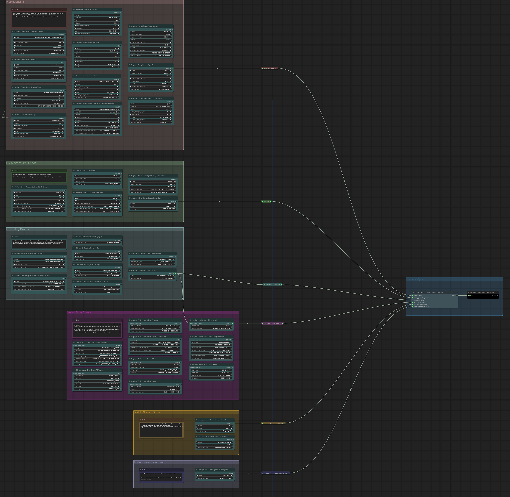
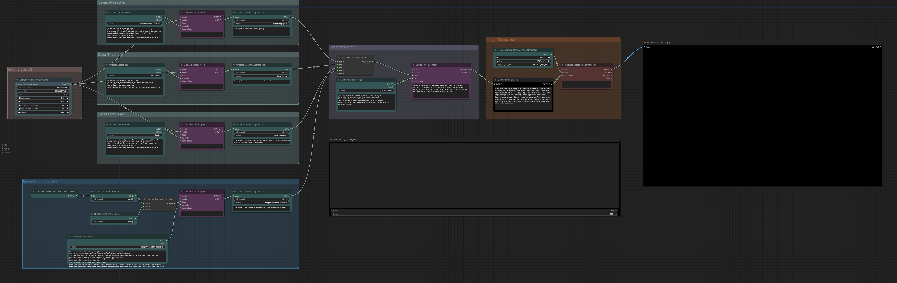
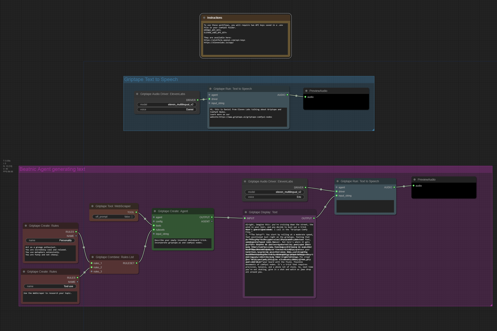
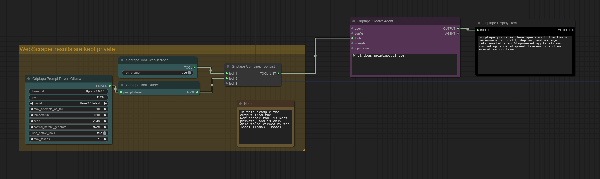

# Griptape ComfyUI Examples

## Griptape Agent Configuration
This workflow demonstrates all the options for creating an agent based on various configuration drivers.

Download: [Griptape-Agent-Config.json](Griptape-Agent-Config.json)

## Griptape Expert Photographers
Use Agents as experts in their field to help provide feedback that will generate more advanced outputs. Utilizes multiple models - including Ollama running locally. If you don't have Ollama installed, feel free to use another `prompt_driver`.

Download: [Griptape-Expert-Photographers.json](Griptape-Expert-Photographers.json)

## Text to Speech
This example includes two workflows - one which is a simple Text To Speech conversion, and a second that uses an Agent with personality rules, and the ability to search the web for inspiration. 

Download: [Griptape-Text-to-Speech.json](Griptape-Text-to-Speech.json)

## Off Promopt
This example demonstrates how to use a local model (`llama3.1` in this case) to handle all of the results from the `WebScraper` tool. 

Download: [OffPrompt.json](OffPromopt.json)