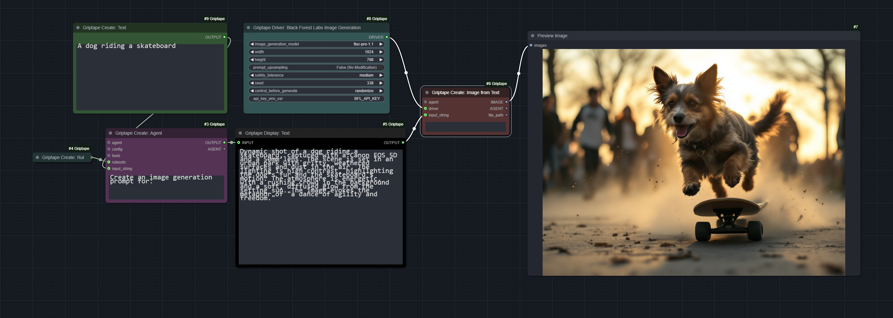
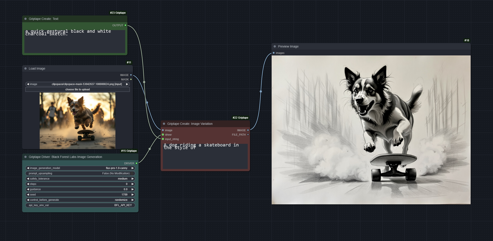
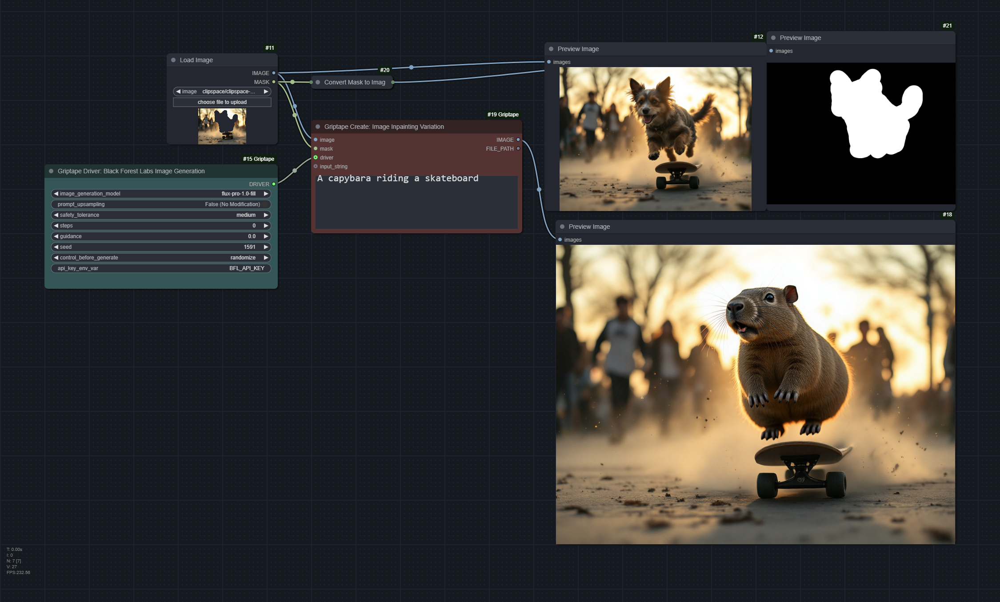

# Griptape ComfyUI Examples

## Griptape Agent Configuration
This workflow demonstrates all the options for creating an agent based on various configuration drivers.

Download: [Griptape-Agent-Config.json](Griptape-Agent-Config.json)

## Render Log Review
It's handy to be able to review render logs and quickly understand your next actions to resolve any errors. In this example, Griptape uses Anthropic Claude Sonnet-3.5 to review an Autodesk Maya render log and return a summary of errors and recommended next actions.

Download: [render_log_review.png](render_log_review.png)

## Black Forest Labs - Flux Pro 1.1 Image Generation
Use Black Forest Labs Flux models with Griptape!

Download: [griptape_black_forest_labs_create_image.png](griptape_black_forest_labs_create_image.png)

## Black Forest Labs - Flux Pro 1.0-Canny - Image Variation

Use Black Forest Labs Flux-Pro-1.0-canny with Griptape to create a variation on an image.

Download: [griptape_black_forest_labs_create_variation.png](griptape_black_forest_labs_create_variation.png)

## Black Forest Labs - Flux Pro 1.0-Fill - Image Inpainting

Use Black Forest Labs Flux-Pro-1.0-fill with Griptape to perform inpainting on an image.

Download: [griptape_black_forest_flux_inpainting.png](griptape_black_forest_flux_inpainting.png)

## Griptape Expert Photographers
Use Agents as experts in their field to help provide feedback that will generate more advanced outputs. Utilizes multiple models - including Ollama running locally. If you don't have Ollama installed, feel free to use another `prompt_driver`.

Download: [Photographer-Workflow-Comparison-Example.json](Photographer-Workflow-Comparison-Example.json)

## Text to Speech
This example includes two workflows - one which is a simple Text To Speech conversion, and a second that uses an Agent with personality rules, and the ability to search the web for inspiration. 

Download: [Griptape-Text-to-Speech.json](Griptape-Text-to-Speech.json)

## Off Prompt
This example demonstrates how to use a local model (`llama3.1` in this case) to handle all of the results from the `WebScraper` tool. 

Download: [OffPrompt.json](OffPromopt.json)

## RAG (Retrieval Augmented Generation)
Use Retrieval Augmented Generation to have more control over the data your agents can query. Check out this example which demonstrates multiple data sources, reranking results, and controling the responses.

Download: [retrieval_augmented_generation.json](retrieval_augmented_generation.json)